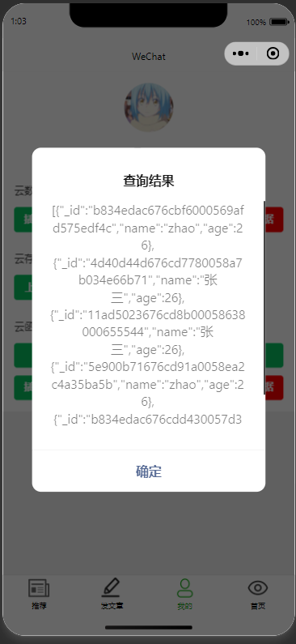
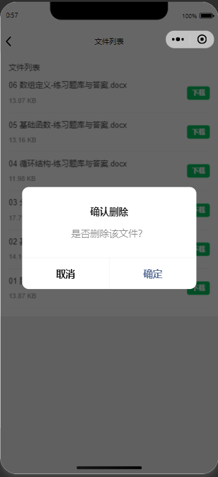

# 微信小程序云开发博客系统

## 项目介绍
这是一个基于微信小程序云开发的博客系统，实现了用户管理、文章发布、云存储、云函数等功能。项目采用云开发模式，无需搭建服务器，通过云函数和云数据库实现后端功能。

## 功能特性
- 用户管理
  - 用户登录
  - 头像和昵称设置
  - OpenID 获取
- 文章管理
  - 文章发布
  - 文章列表展示
  - 点赞功能
  - 阅读统计
- 云存储功能
  - 文件上传
  - 文件下载
  - 文件列表管理
- 云函数功能
  - 数据库操作（增删改查）
  - 用户信息获取
  - 简单计算示例

## 技术栈
- 微信小程序原生开发
- 微信云开发
  - 云函数
  - 云数据库
  - 云存储
- JavaScript/WXML/WXSS

## 项目结构
```
├── cloudfunctions/          # 云函数目录
│   ├── getOpenId/          # 获取用户OpenID
│   ├── importBlogData/     # 导入博客数据
│   ├── operateDB/          # 数据库操作
│   └── sum/                # 计算示例
├── miniprogram/            # 小程序源码
│   ├── pages/             # 页面文件
│   │   ├── addblog/      # 发布文章
│   │   ├── auth/         # 用户授权
│   │   ├── blog/         # 文章列表
│   │   ├── content/      # 文章详情
│   │   ├── fileList/     # 文件列表
│   │   ├── index/        # 首页
│   │   └── my/           # 个人中心
│   ├── images/           # 图片资源
│   └── app.js            # 小程序入口文件
└── project.config.json    # 项目配置文件
```

## 功能展示

### 用户管理
- 用户登录界面


### 文章管理
- 文章列表

利用云函数向云数据库中导入两条案例博客数据，并展示在文章列表中


- 发布文章


- 文章详情


### 云数据库功能



### 云存储功能
- 文件上传


- 文件列表


- 文件删除（删除云存储中的文件，通过长按鼠标的方式）



- 文件删除成功


### 云函数功能
- 数据库操作界面


- 计算示例


- 获取用户OpenID


## 安装和使用
1. 克隆项目
bash
git clone https://github.com/your-username/your-project-name.git


2. 导入项目
- 打开微信开发者工具
- 选择导入项目
- 选择项目目录

3. 云开发环境配置
- 开通云开发环境
- 修改 `app.js` 中的环境ID
- 创建必要的数据库集合

4. 部署云函数
- 在云函数目录上右键选择"上传并部署：云端安装依赖"

## 开发说明
1. 数据库集合
- blog: 博客文章集合
- user: 用户信息集合
- files: 文件信息集合

2. 云函数说明
- getOpenId: 获取用户OpenID
- operateDB: 数据库操作函数
- sum: 简单计算示例

## 注意事项
- 需要配置合适的云开发环境
- 注意数据库权限设置
- 及时部署云函数的更新

## 贡献指南
欢迎提交 Issue 和 Pull Request

## 许可证
MIT License

## 联系方式
[在这里添加您的联系方式]

## 更新日志
### v1.0.0 (2024-12-27)
- 初始版本发布
- 实现基本功能
